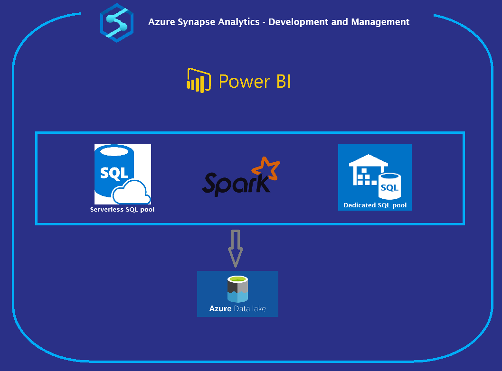

# Azure Synapse Analytics

## Overview
This repository contains the code and configuration for a data engineering project that ingests, transforms, and loads NYC taxi data into an **Azure Synapse Analytics data warehouse.** The data transformation process is organized into Bronze, Silver, and Golden layers for progressive refinement.

## Clone the repository: ```git clone https://github.com/AmmarSahyoun/Azure-Synapse-Analytics.git```

## Architecture
 


## Data Ingestion
* Sources: CSV, TSV, JSON, and Parquet files containing NYC taxi data.
* Requirement: Store data in parquet formatting and provide the correct schema and data types. 
* Process: Data is ingested by different pipelines approaches into the Bronze layer.

## Data Transformation
* Bronze layer: Raw data is loaded.
* Silver layer: Data is cleaned, transformed, and enriched.
* Golden layer: Data is aggregated and optimized for reporting.
* Tools: Azure Synapse Serverless SQL pool, Dedicated SQL pool, and Spark pool.

## Data Warehousing
* Created database and Parquet tables to write data from silver layer
* Aggregate data in a denormalized tables
* Dimensional modeling according to business needs.

## Master Pipeline
* Encapsulate all pipelines to orchestrate the execution of various pipelines with proper triggers.

## Reporting: 
* Create power bi linked service with dedicated sql pool.

## CI/CD Pipeline:
* Setup a github repo with 3 branches that represent 3 layers: Bronze, Silver and Gold.
<br />
|Bronze|Silver|Gold|
|----|-----|-------|
|Row data discovery |Transformed joined tables|AggregateD queries| 


