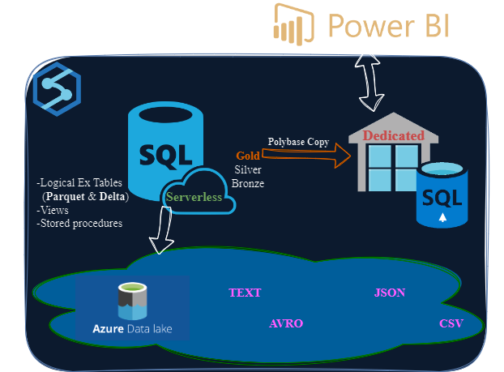

# Azure Synapse Analytics

## Overview
This repository contains the code and configuration for a data engineering project to create a discovery logical data warehouse by serverless SQL pool
ingests, transforms, and loads NYC taxi data into an **Azure Synapse Analytics platform** 

## Clone the repository: 
```
git clone https://github.com/AmmarSahyoun/Azure-Synapse-Analytics.git
```
|Bronze|Silver|Gold|
|----|-----|-------|
|Row data discovery |Transformed joined tables|Aggregated queries| 

## Architecture
 


## Leveraging Serverless SQL Pool for performance optimization and reduce costs
* Create logic discovery database and add various schemas (bronze, silver, gold)
* Ingestion in bronze by creating **external table** read from (CSV, TSV, JSON, Parquet and delta) ADLS2 
* Add views to enforce **RBAC** on row and columns and encapsulate repeated logic
* transfer data through **CETAS** with new (table format, column data types and names) 
* Implement logical partitioning and manual statistics
* Utilize stored procedures to improve security and get more programing functionality in SQL for advance aggregation
* Encapsulate the whole process in a pipeline, add **trigger** (tumbling, schedule) to run the pipeline.

## Leveraging Distributed Dedicated SQL Pool for high performance analytics
* Polybase-Copy from serverless(Gold) into dedicated sql (Dimensional modeling) to **serve as report layer** 
* Traditional data warehouse with massively parrallel processing engine
* shard data into 60 distributions to paralyse the workload and optimize performance

## Data Transformation
* Bronze layer: Raw data is loaded.
* Silver layer: Data is cleaned, transformed, and enriched.
* Golden layer: Data is aggregated and optimized for reporting.
* Tools: Azure Synapse Serverless SQL pool, Dedicated SQL pool, and Spark pool.

## Data Warehousing
* implement indexes, partitioning and clustering.
* Add logic rules and aggregations
* Build Dimensional modeling according to business needs.

## Master Pipeline
* Encapsulate all pipelines to orchestrate the execution of various pipelines with proper triggers.

## Reporting: 
* Create power bi linked service with dedicated sql pool.

## CI/CD Pipeline:
* Setup a github repo with 3 branches that represent 3 layers: dev, test and prod.


